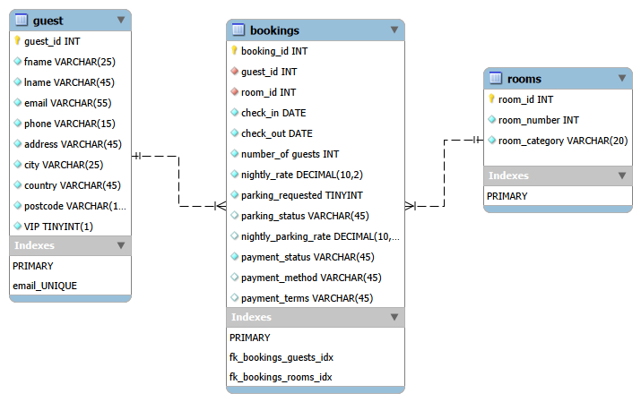

# bed_and_breakfast_sql_analysis
A MySQL project modelling a small B&amp;B's bookings, guests and rooms, with SQL queries to answer business questions.

## Project Overview

This is my second SQL portfolio project, created to practise designing and building a relational database and using SQL to answer business questions.

I created a fictional seven-room B&B in York, with a database to manage guest information, room details and bookings, including accommodation rates, parking charges and payment information.

After creating the database and populating it with sample data, I worked through a series of requests from the fictional B&B owner, using SQL to investigate repeat guests, accommodation booking values and outstanding payments.

After completing my first guided SQL project, I wanted to put what I'd learned into practice and challenge myself to build a database from scratch, as independently as possible. I used AI as a learning resource when I needed guidance or clarification, while taking responsibility for the database design, implementation and SQL analysis.

The project was built using MySQL and MySQL Workbench.

## Database Structure

I designed the database around three tables:

- **guest** – Contains information about each guest, including their contact details and VIP status.
- **rooms** – Contains the seven rooms available at the B&B and their categories.
- **bookings** – Connects guests to their reservations and records the dates, prices, parking requests and payment details.

I used primary and foreign keys to connect the tables, so that guests can make multiple bookings and rooms can be booked by different guests over time.

I also added constraints to prevent certain errors, such as duplicate email addresses or room numbers, invalid payment statuses and check-out dates that come before check-in dates.

One decision I made was to store the nightly rates in the bookings table rather than the rooms table. This means that if the B&B changes its prices, previous bookings will still show the rates originally agreed.

### Entity Relationship Diagram

This is the EER diagram I created to plan the database and its relationships.

## SQL Analysis

After creating and populating the database, I worked through four business questions from the fictional B&B owner:

1. **Returning guests:** Identify guests who have made more than one booking.
2. **Accommodation value by room:** Calculate the total value of accommodation booked for each room, excluding parking charges.
3. **Outstanding payments:** Identify unpaid bookings and calculate the accommodation amount outstanding for each.
4. **Accommodation value by guest:** Calculate each guest's total accommodation booking value and number of bookings.

To answer these questions, I used SQL techniques including joins, filtering with WHERE, aggregation with COUNT and SUM, GROUP BY, HAVING, ORDER BY and calculated fields using DATEDIFF.

The analysis helped me practise turning business questions into SQL queries and presenting the results in a way that would be useful to a business owner.
